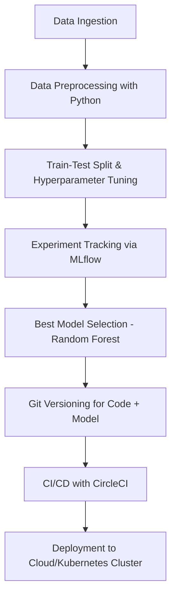

# 🌸 SepalSense AI

SepalSense AI is a sleek, production-ready **Iris Flower Classification App** built using **Kubeflow pipelines** and a modern MLOps stack. It predicts the species of an Iris flower based on input features — making it a perfect template for deploying ML models using scalable cloud infrastructure.

---

## 🚀 Model Metrics 

> 📊  
>   

---

## 📌 Problem Statement

Classifying Iris species is a classical ML task often used to benchmark workflows and pipeline automation. The goal of this project is to deploy a lightweight, accurate classification model using **end-to-end MLOps with Kubeflow** — showcasing how even simple ML tasks can benefit from production-grade automation and deployment.

---

## 🧠 Key Features

- Predict **Iris flower species** (Setosa, Versicolor, Virginica)
- Built with **Kubeflow Pipelines** for reproducible ML workflows
- Fast, browser-based input and predictions via Flask UI
- Supports automated versioning and containerized deployment
- Interactive UI with modern styling and animation

---

## 🛠️ Tools & Technologies Used

| Task | Tools / Services |
|------|------------------|
| Data Handling | `pandas`, `numpy`, `seaborn`, `scikit-learn` |
| Model Training | `scikit-learn`, Jupyter |
| ML Pipeline Orchestration | **Kubeflow Pipelines** |
| Experiment Tracking | **MLflow** |
| Model Deployment | **Flask**, Docker, Kubernetes |
| Code & Model Versioning | `Git`, `DVC` *(optional)* |
| Frontend Styling | HTML, CSS (with animations) |
| CI/CD | **CircleCI**, DockerHub/Kubernetes |

---

## 🤖 Models Trained

Multiple classifiers were evaluated using standard classification metrics:

- ✅ **Random Forest Classifier** *(Chosen for balance of speed and accuracy)*
- K-Nearest Neighbors (KNN)
- Logistic Regression
- Decision Tree
- Support Vector Machine (SVC)

> 🏆 Final choice: **Random Forest Classifier**
> - ~97% accuracy on test data
> - Low inference latency
> - Robust to feature variations

---

## 🔄 MLOps Pipeline Overview



## 📂 Folder Structure
```
SepalSense-AI/
│
├── data/                  # Processed and raw data
├── notebooks/             # Jupyter Notebooks for EDA and training
├── models/                # Saved ML models
├── mlruns/                # MLflow tracking files
├── .circleci/             # CircleCI config files
├── src/                   # Source scripts (preprocessing, training, etc.)
├── app/                   # Flask web app code
├── Dockerfile             # For containerized deployment
├── requirements.txt       # Python dependencies
└── README.md              # This file
```

## 🚦 CI/CD & Deployment

CircleCI automates the full ML pipeline: training, testing, and deployment

Docker containers are built and pushed to DockerHub (or other registry)

Model and web app are deployed to a Kubernetes cluster

Supports automatic retraining and redeployment on main branch push

## 📌 Future Enhancements

Add support for deep learning models

Enable real-time inference via REST APIs

Integrate Streamlit or React frontend for enhanced UX

Add auto-scaling and monitoring (Prometheus + Grafana)

## ✨ Credits
Made with ❤️ by Sri Rumde  
